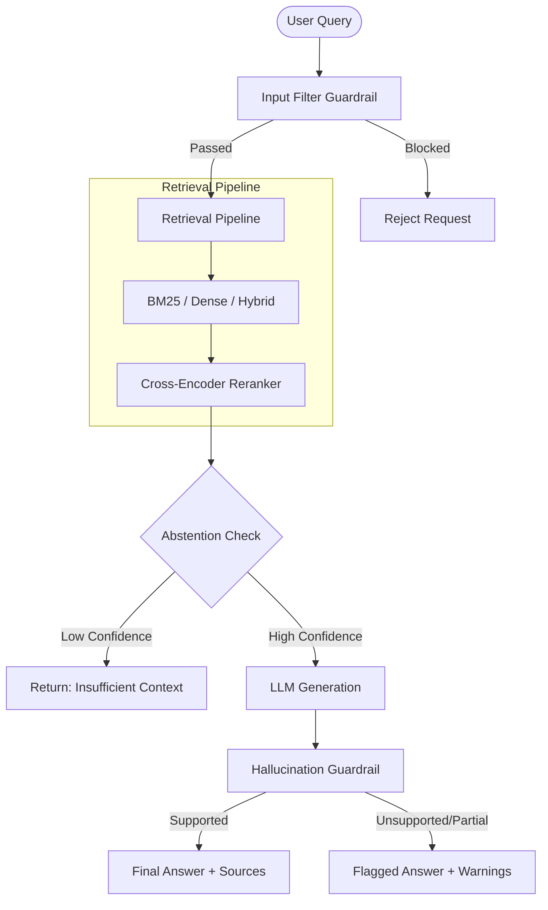

# ⚖️ ContractIQ

> A production-ready, guarded Retrieval-Augmented Generation (RAG) system for legal contract Q&A, benchmarked on the CUAD dataset.

ContractIQ is designed to answer complex legal questions based on contract documents. It goes beyond standard RAG by implementing robust **guardrails** to ensure reliability, prevent hallucinations, and protect against adversarial inputs.

---

## ✨ Key Features

- **🛡️ Guarded RAG Pipeline**: Built-in guardrails for production safety:
  - **Input Filtering**: Scans user questions for adversarial or out-of-scope inputs.
  - **Abstention Mechanism**: Refuses to answer if the retrieval confidence is too low.
  - **Hallucination Detection**: Cross-checks LLM generation against retrieved context to flag unsupported claims.
- **🔍 Advanced Retrieval Strategies**: Supports multiple retrieval techniques:
  - **Lexical (BM25)**
  - **Dense Vector Search**
  - **Hybrid Retrieval**
  - **Cross-Encoder Reranking**
- **⚡ Fast Web Services**: 
  - **FastAPI Backend**: High-performance REST API.
  - **Streamlit Chat UI**: Intuitive frontend interface for easy interaction.
- **📊 Pre-benchmarked**: Evaluated on the CUAD (Contract Understanding Atticus Dataset) using the LegalBench-RAG methodology.

---

## 🏗️ Architecture

The guarded RAG pipeline ensures high-quality and safe interactions:



---

## 🚀 Quick Start

### 1. Installation

Ensure you have Python 3.11+ installed. Create a virtual environment and install dependencies:

```bash
# Create and activate virtual environment
python -m venv .venv
# Windows: .\.venv\Scripts\activate
# Unix: source .venv/bin/activate

# Install dependencies
pip install -r requirements.txt
```

### 2. Run the Backend API

Start the FastAPI backend server (runs on port 8000 by default):

```bash
export PYTHONPATH=src
uvicorn api.main:app --reload
```

### 3. Run the Streamlit Chat UI

In a separate terminal, start the Streamlit frontend:

```bash
export PYTHONPATH=src
streamlit run frontend/app.py
```

Now, navigate to `http://localhost:8501` to start querying your legal contracts!

---

## 📂 Project Structure

```text
ContractIQ/
├── api/                  # FastAPI backend service
├── frontend/             # Streamlit chat interface
├── src/
│   └── contractiq/       # Core package
│       ├── chunking/     # Structure-aware and fixed chunking
│       ├── generation/   # LLM client abstractions
│       ├── guardrails/   # Input filter, abstention, hallucination checks
│       └── retrieval/    # BM25, Dense, Hybrid, Reranker implementations
├── scripts/              # Evaluation and regression scripts
├── tests/                # Unit tests (pytest)
├── data/
│   ├── corpus/           # 510 CUAD contracts as plain text
│   └── benchmarks/       # Ground-truth queries for evaluation
└── eval_results/         # Benchmark results and observability logs
```

---

## 📈 Evaluation & Baselines

ContractIQ's chunking and retrieval strategies are benchmarked against the CUAD dataset. The evaluation answers use character-level precision/recall/F1 following the LegalBench-RAG methodology.

**Day 1 Baseline (BM25 only):**

| Chunking Strategy | Precision | Recall | F1 |
|-------------------|-----------|--------|----|
| `naive_fixed`     | 0.0109    | 0.0810 | 0.0171 |
| `structure_aware` | 0.0105    | 0.0850 | 0.0170 |

> [!NOTE]
> Absolute numbers are low due to CUAD answer spans being short phrases inside larger chunks. This baseline serves as a starting point to improve upon with Dense/Hybrid retrieval and Reranking.

---

## 📜 Source & Attribution

- Built using **CUAD v1** (Hendrycks et al., 2021), Creative Commons Attribution 4.0.
- Benchmark methodology inspired by **LegalBench-RAG** (Pipitone & Houir Alami, 2024).
